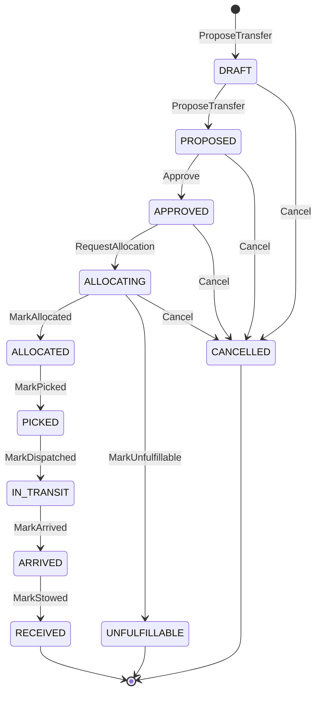

# Aggregate design canvas

Following the ddd-crew [Aggregate Design Canvas v1.1](https://github.com/ddd-crew/aggregate-design-canvas).
This context has **one aggregate**, `InterWarehouseTransfer`. The planner, the
planning snapshot and the read models are not aggregates (last section).

## 1. Name

`InterWarehouseTransfer` (`internal/domain/transfer/saga.go`, `workflow.go`).
Identity `TransferID`, minted as `trf-<uuid>` by `ApproveTransfer`; its single
line is `<transfer_id>:1`.

## 2. Description

An operator-approved plan to move a quantity of one SKU from an origin site to
a destination site, driven by inventory-storage's and fulfillment-execution's
replies and facts. It references the origin reservation and the stow
allocations but owns neither. Fields are unexported and change only through
the command methods, each of which appends an immutable audit entry.

## 3. State transitions

Source: `internal/domain/transfer/saga.go`, `internal/domain/transfer/workflow.go`

`ProposeTransfer` records `DRAFT` and `PROPOSED`; `ApproveTransfer` then
applies `Approve` and `RequestAllocation` in the same unit of work, so a fresh
approval is persisted in `ALLOCATING`. `RECEIVED`, `UNFULFILLABLE` and
`CANCELLED` are terminal.

## 4. Enforced invariants

- Origin ≠ destination; quantity > 0; transfer id, idempotency key, sites,
  SKU, policy version, proposal as-of, clock and expiry required; the expiry
  must be after now (`ErrProposalExpired`). Refusals are `ErrInvalidProposal`.
- `Approve` only from `PROPOSED` and strictly before `expires_at`.
- Every illegal transition returns `IllegalTransitionError` and changes nothing.
- `MarkAllocated`: line `<id>:1`, same origin and SKU, a reservation id, every
  allocation with stock unit, bin and positive quantity, allocations summing to
  the transfer quantity, an expiry.
- `MarkUnfulfillable`: closed reason (`ORIGIN_SITE_UNKNOWN`,
  `INSUFFICIENT_USABLE`, `IDEMPOTENCY_CONFLICT`) and matching line.
- `MarkPicked`: only from `ALLOCATED`; `0 < picked ≤ quantity`, otherwise
  `ErrFactRefused`; a short pick is recorded.
- `MarkArrived`: only from `IN_TRANSIT`, from either `TransferArrived` or
  `TransferReceiptStaged`; the first wins.
- `MarkStowed`: only from `ARRIVED`; same line, destination and SKU; stowed
  quantity > 0; at least one stow allocation (`ErrFactRefused` otherwise).
- `Cancel`: only from `DRAFT`, `PROPOSED`, `APPROVED`, `ALLOCATING`, with a
  reason.
- Persistence mirrors the rules with named CHECK constraints (closed state
  enum, origin ≠ destination, reservation id only from `ALLOCATED` on, picked
  quantity only from `PICKED` on and never above quantity), a UNIQUE
  idempotency key and optimistic concurrency on `version`.

## 5. Corrective policies

- Replies and facts for an unknown transfer, an illegal transition or a
  refused fact are logged and committed past.
- Transient failures are retried on the same message (200ms doubling to 5s).
- A mismatched allocation or rejection reply returns a plain error and is
  therefore retried like a transient one (a gap, see
  [Troubleshooting](../operations/troubleshooting.md)).
- Stuck transfers are only observed (`TransferStuckDetected`); nothing cancels,
  retries or releases automatically.
- `allocation_expires_at` is stored but no policy acts on it.

## 6. Handled commands

| Command | Entry point | Methods |
| --- | --- | --- |
| Approve a proposal | `POST /v1/transfers:approve` | `ProposeTransfer`, `Approve`, `RequestAllocation` |
| Apply allocation | Kafka `TransferStockAllocated` | `MarkAllocated` |
| Apply rejection | Kafka `TransferStockAllocationRejected` | `MarkUnfulfillable` |
| Apply pick | Kafka `TransferPicked` | `MarkPicked` |
| Apply dispatch | Kafka `TransferDispatched` | `MarkDispatched` |
| Apply arrival | Kafka `TransferArrived` or `TransferReceiptStaged` | `MarkArrived` |
| Apply stow | Kafka `TransferStockStowed` | `MarkStowed` |
| Cancel | none (tests only) | `Cancel` |

## 7. Created events

| Domain event | Raised by | Wire type |
| --- | --- | --- |
| `PlanApproved` | `Approve` | `...transfer.TransferPlanApproved` |
| `AllocationRequested` | `RequestAllocation` | `...transfer.TransferAllocationRequested` |
| `DemandReleased` (pick) | `ApplyTransferAllocation` after `MarkAllocated` | `...workdemand.WorkDemandReleased` |
| `DemandReleased` (dispatch) | `ApplyTransferPick` after `MarkPicked` | `...workdemand.WorkDemandReleased` |
| `StateAdvanced` | derived from new audit entries (`StateAdvancedSince`) by the approval, allocation and pick use cases | `...saga.TransferStateAdvanced` |

## 8. Throughput and 9. Size

One transfer = one operator approval, four integration events (two of them
work demands), up to five inbound replies and facts. A completed transfer has
nine audit rows (`DRAFT` … `RECEIVED`) and one `inter_warehouse_transfer` row
with JSONB allocations and stow allocations. The repository contains no
throughput or size measurement.

## Not aggregates

- `planning.SiteCapability`, `SiteSkuDemand`, `PublishedCapacityPlan`: local
  read-model facts with validation and `Supersedes`.
- `planning.BuildSnapshot` / `PlanningSnapshot`: a pure domain service and its
  value.
- `transfer.Planner`, `Position`, `Policy`, `Lane`, `Proposal`,
  `ScoreBreakdown`: deterministic value objects and service.
- `transfer.ValidateApproval`, `StuckCheck`, `StuckThresholds`: pure services.
- `transfer.RebalanceRun`: a persisted record of a scheduled pass.
