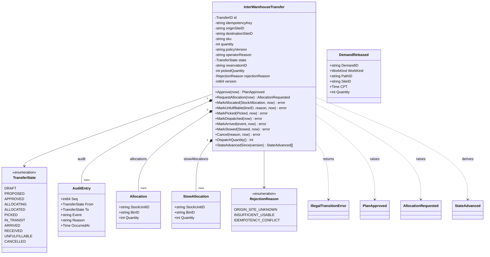
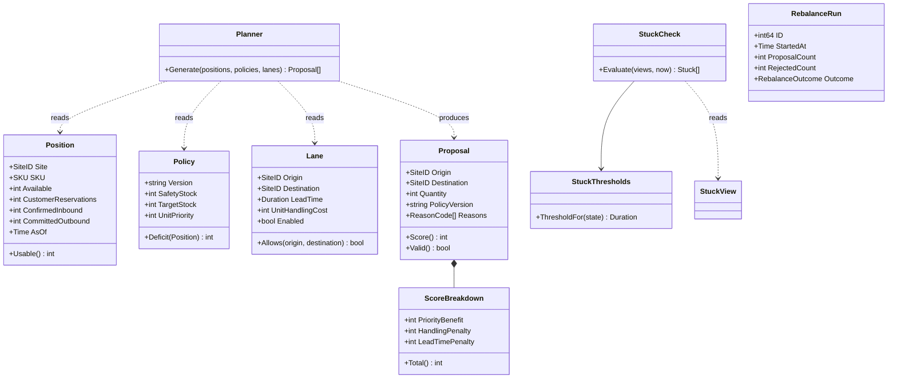
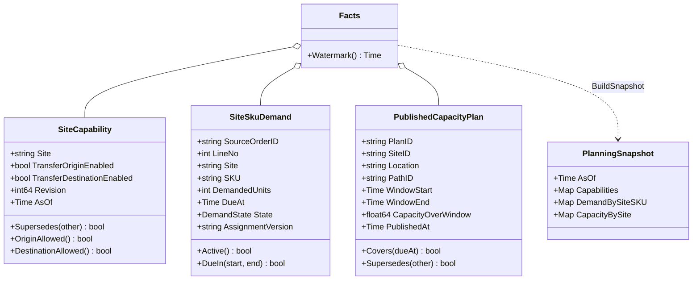

# Class diagrams

UML class diagrams of `internal/domain/**`, then the ports and adapters around
them. Only types and methods that exist in the code are drawn; plain getters
are left out. The fields of `InterWarehouseTransfer` are unexported in the
code and shown as private attributes.

## Package `transfer`: the saga aggregate

Source: `internal/domain/transfer/saga.go`, `workflow.go`, `events.go`, `analytics.go`

`DemandReleased` is built by the use cases (`pickDemand`, `dispatchDemand`)
from a loaded transfer, not raised by the aggregate.

## Package `transfer`: planner, stuck detection, runs

Source: `internal/domain/transfer/model.go`, `planner.go`, `stuck.go`, `analytics.go`

`ValidateApproval` (`approval.go`) and `ParseStuckThresholds` are package
functions, not types.

## Package `planning`

Source: `internal/domain/planning/capability.go`, `demand.go`, `capacity_plan.go`, `facts.go`, `snapshot.go`

## Ports and adapters

```mermaid
classDiagram
  class TransferRepository {
    <<interface>>
    +Create(transfer, key) existing
    +Load(id) transfer
    +UpdateState(transfer)
  }
  class TransferQuery {
    <<interface>>
    +Get(id)
    +List(filter)
  }
  class TransferEventPublisher {
    <<interface>>
    +Publish(events)
  }
  class PlanningSnapshotRepository {
    <<interface>>
    +Load() Facts
  }
  class ProcessedEventRepository {
    <<interface>>
    +Claim(consumer, eventID) bool
  }
  class UnitOfWork {
    <<interface>>
    +Do(fn) error
  }
  class RebalanceRunRepository {
    <<interface>>
    +Record(run) id
    +List(limit)
  }
  class StuckTransferReader {
    <<interface>>
    +ListNonTerminal(limit)
  }
  class ApproveTransfer
  class SimulateTransferOptions
  class RunScheduledRebalance
  class CheckStuckTransfers
  class GetTransfer
  class ListTransfers
  class FindStuckTransfers
  class TransferRepo
  class TransferQueryRepo
  class OutboxWriter
  class SnapshotRepo
  class RebalanceRunRepo
  ApproveTransfer --> TransferRepository
  ApproveTransfer --> TransferEventPublisher
  ApproveTransfer --> PlanningSnapshotRepository
  ApproveTransfer --> UnitOfWork
  SimulateTransferOptions --> PlanningSnapshotRepository
  RunScheduledRebalance --> RebalanceRunRepository
  RunScheduledRebalance --> TransferEventPublisher
  CheckStuckTransfers --> StuckTransferReader
  CheckStuckTransfers --> TransferEventPublisher
  GetTransfer --> TransferQuery
  ListTransfers --> TransferQuery
  FindStuckTransfers --> TransferQuery
  TransferRepo ..|> TransferRepository
  TransferRepo ..|> StuckTransferReader
  TransferQueryRepo ..|> TransferQuery
  OutboxWriter ..|> TransferEventPublisher
  SnapshotRepo ..|> PlanningSnapshotRepository
  RebalanceRunRepo ..|> RebalanceRunRepository
```

Source: `internal/application/ports/*.go`, `internal/application/usecases/*.go`, `internal/adapters/outbound/postgres/*.go`, `cmd/network-inventory-planning/main.go`

`TransferRepo` serves both the saga repository and the stuck-transfer reader
(`wireHealthTicker` passes `postgres.NewTransferRepo(pool)` as the reader).
