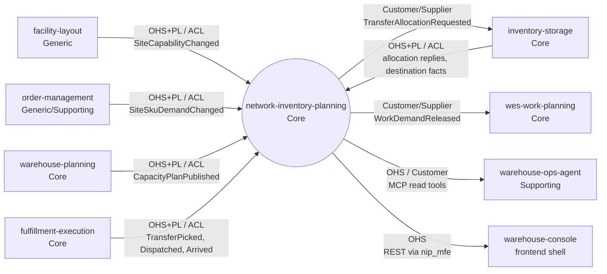

# Context map

This context's slice of the fleet map, following ddd-crew
[Context Mapping](https://github.com/ddd-crew/context-mapping). Neighbour
classifications come from the fleet table (see
[Subdomain classification](./subdomain-classification.md)).

Source: `internal/adapters/inbound/kafka/consumers.go`, `transfer_reply_consumer.go`, `transfer_fact_consumer.go`, `internal/adapters/outbound/kafka/publisher.go`, `internal/adapters/inbound/mcp/tools.go`, `web/src/api.ts`

## Relationships

| # | Upstream | Downstream | Patterns (U / D) | Technology | Evidence |
| --- | --- | --- | --- | --- | --- |
| 1 | facility-layout | NIP | OHS + Published Language / ACL: `siteCapabilityChangedData` mirrored into `site_capability` | Kafka `warehouse.facility.events` | `consumers.go` |
| 2 | order-management | NIP | OHS + PL / ACL: one order line = one `site_sku_demand` row | Kafka `warehouse.order-management.events` | `consumers.go` |
| 3 | warehouse-planning | NIP | OHS + PL / ACL: plans kept per `plan_id`, legacy events without `site_id` excluded | Kafka `warehouse.warehouse-planning.events` | `consumers.go` |
| 4 | NIP | inventory-storage | Customer/Supplier: the command's payload is exactly the five fields inventory-storage's consumer defines | Kafka `warehouse.network-inventory-planning.events` | `publisher.go`; inventory-storage `cmd/inventory/transfer.go` |
| 5 | inventory-storage | NIP | OHS + PL / ACL: replies and facts hand-mirrored, closed rejection vocabulary | Kafka `warehouse.inventory.events` | `transfer_reply_consumer.go` |
| 6 | NIP | wes-work-planning | Customer/Supplier: payload mirrors WES's consumed contract; WES validates `path_id` and mints one work unit per `demand_id` | Kafka `warehouse.network-inventory-planning.events` | `transfer_facts.go`; wes-work-planning `internal/adapters/inbound/kafka/consumer.go` |
| 7 | fulfillment-execution | NIP | OHS + PL / ACL: `TransferFactData` hand-mirrored | Kafka `warehouse.fulfillment.events` | `transfer_fact_consumer.go` |
| 8 | NIP | warehouse-ops-agent | OHS / Customer: four read tools, no write tool | MCP Streamable HTTP | `internal/adapters/inbound/mcp/tools.go`; the agent's `NETWORK_INVENTORY_PLANNING_MCP_ENDPOINT` |
| 9 | NIP | warehouse-console | OHS: the console hosts this context's own remote `nip_mfe`, which calls the REST API through Kong | REST `/api/network-inventory-planning` | `web/`, ADR 0010 |

No sibling Go package is imported and every inbound payload is translated
locally, so there is no Shared Kernel, Partnership or Conformist edge in the
strict sense. Rows 4 and 6 come closest to conformance because the receiver
defines the command contract, which is the right call for a command.

**Separate ways:** workforce-management, labor-performance,
process-path-management, network-fulfillment, product-master,
inbound-receiving and slotting-optimization have no edge with NIP. The
configured `TRANSFER_PICK_PATH_ID` / `TRANSFER_DISPATCH_PATH_ID` must name paths
that wes-work-planning knows (fed by process-path-management): a deployment
prerequisite, not an integration edge.
