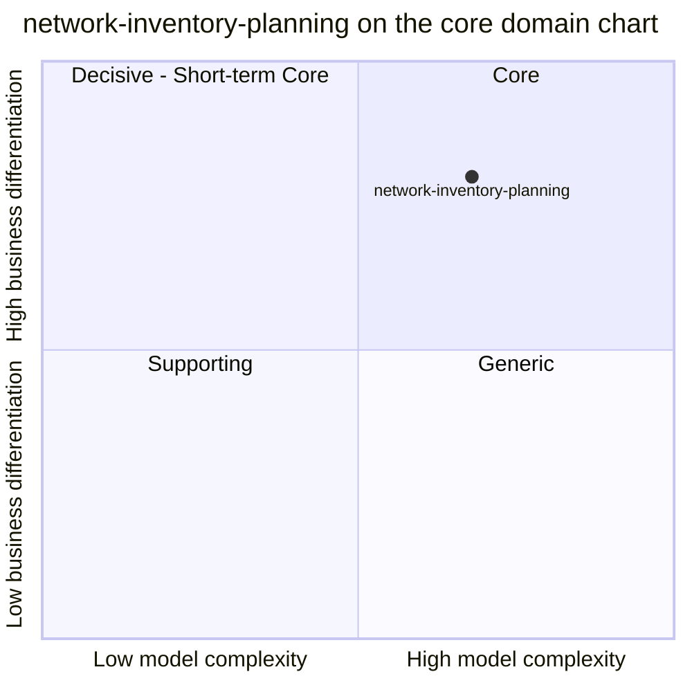

# Core domain chart

Following the ddd-crew [Core Domain Charts](https://github.com/ddd-crew/core-domain-charts):
business differentiation on the vertical axis, model complexity on the
horizontal axis. The coordinates are a judgement from the evidence below, not a
measurement.

Source: `docs/docs/adr/0001-network-inventory-planning-boundary.md`, `internal/domain/transfer/*.go`, `internal/domain/planning/*.go`.
Omits the sibling contexts (their own charts place them).

## Classification: Core

ADR 0001 creates the context as a WES-core bounded context, and the fleet
classification ([Subdomain classification](./subdomain-classification.md))
agrees.

**Business differentiation is high (y = 0.80).** No other context decides
whether stock should move between warehouses: inventory-storage holds stock
per site, order-management knows demand, warehouse-planning knows throughput,
and none relates them. A recommendation is reproducible (policy version,
reason codes, score breakdown) and an approved transfer is carried to the
destination as a saga without a distributed transaction. It is held back from
the top because no forecasting or optimisation exists and the read-model path
cannot produce proposals yet (the scheduled rebalance feeds the planner no
positions, policies or lanes).

**Model complexity is high (x = 0.68).** Evidence in the code:

- one saga aggregate with eleven states, an append-only audit trail,
  optimistic concurrency (`version`) and a unique idempotency key;
- a fail-closed `BuildSnapshot` over three read models with three different
  supersede rules and half-open window arithmetic that never zero-fills;
- five OLTP consumers plus the analytics projector, a transactional outbox and
  a relay that keeps id order;
- contracts mirrored byte-for-byte from inventory-storage, wes-work-planning
  and fulfillment-execution without importing their types;
- a second, analytical database with its own projector and reports.

It is not further right because the planning calculation itself is small and
deterministic (minimum of surplus and deficit, a linear score, a sort).

## Evolution

Custom-built and early: twelve ADRs, most of them phases of one plan (read
models and simulation, the approval saga, work release, observability and
scheduled runs, the read side and MCP, analytics, the console remote, BDD, OTLP
export). Known simplifications are explicit in the code: a single transfer
line (`<transfer_id>:1`), a flat 24-hour approval expiry, site-level approval
checks, and no cancellation path once stock is allocated.
