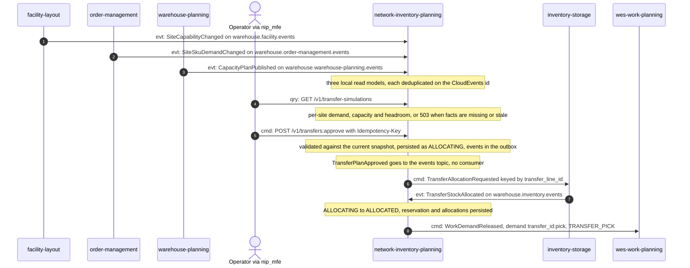
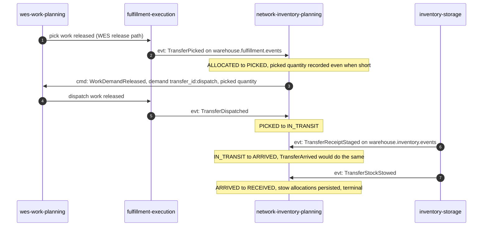
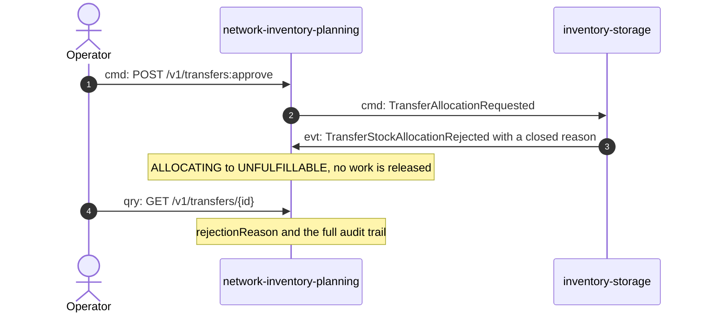
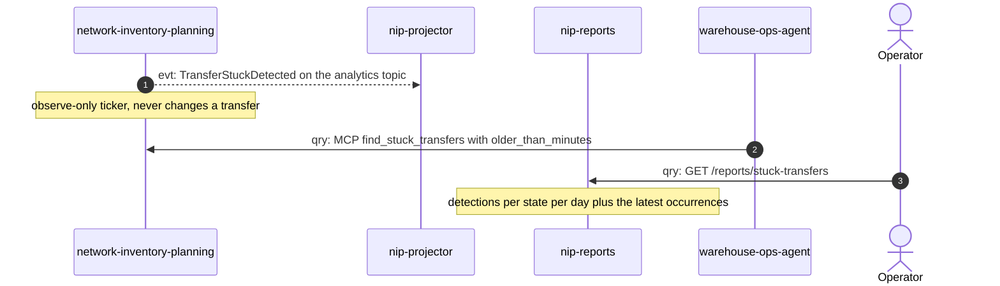

# Domain message flow

Following ddd-crew [Domain Message Flow Modelling](https://github.com/ddd-crew/domain-message-flow-modelling).
Arrows are prefixed `cmd:` (command), `evt:` (event) or `qry:` (query). Only
real messages appear: REST routes from the handler, MCP tools from `tools.go`
and CloudEvents types from the consumers and encoders.

## 1. Facts arrive, an operator approves, stock is reserved, the pick is released

Source: `internal/adapters/inbound/kafka/consumers.go`, `internal/adapters/inbound/http/handler.go`, `internal/application/usecases/approve_transfer.go`, `transfer_facts.go`, `internal/adapters/inbound/kafka/transfer_reply_consumer.go`

The simulation is per site; it does not propose quantities. Proposals come
from `POST /v1/transfer-proposals:generate` with an explicit snapshot.

## 2. The physical tail: pick, dispatch, arrival, stow

Source: `internal/application/usecases/transfer_facts.go`, `internal/adapters/inbound/kafka/transfer_fact_consumer.go`, `transfer_reply_consumer.go`

The `TRANSFER_ARRIVAL` work kind exists in the vocabulary but NIP never
releases it.

## 3. Allocation is refused

Source: `internal/domain/transfer/saga.go` (`MarkUnfulfillable`), `transfer_reply_consumer.go`, `internal/adapters/inbound/http/transfers_read.go`

The saga does not retry or re-plan; the operator approves a new transfer
under a new idempotency key.

## 4. Finding a stuck transfer

Source: `internal/application/usecases/saga_health.go`, `periodic.go`, `internal/adapters/inbound/mcp/tools.go`, `internal/adapters/inbound/http/reports_handler.go`
