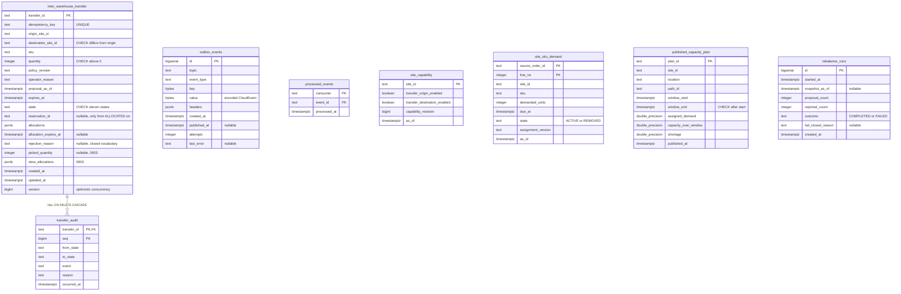
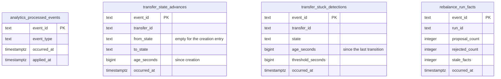

# Entity-relationship diagram

The schemas after applying every migration in order. The service has **two**
Postgres databases:

- the **OLTP** database (`DATABASE_URL`), migrated by
  `cmd/network-inventory-planning` and `cmd/mcp` from
  `internal/adapters/outbound/postgres/migrations` `0001` to `0004`;
- the **analytical** database (`ANALYTICS_DATABASE_URL`), migrated and written
  only by `cmd/nip-projector` from `analytics/migrations/0001`
  ([ADR 0009](../adr/0009-analytics-read-side.md)).

Migrations run through golang-migrate. The OLTP step reads
`MIGRATIONS_DATABASE_URL` and falls back to `DATABASE_URL`, because a
transaction pooler cannot hold golang-migrate's session advisory lock
([ADR 0006](../adr/0006-migrations-over-a-direct-connection.md)).

## OLTP database

Source: `internal/adapters/outbound/postgres/migrations/0001_planning_read_models.up.sql`, `0002_transfer_saga_and_outbox.up.sql`, `0003_work_demand_release.up.sql`, `0004_rebalance_runs.up.sql`

Only `transfer_audit` has a foreign key. The read models mirror sibling facts
and do not reference one another, `processed_events` is a guard keyed by
consumer and event id, and `outbox_events` is a queue.

What the columns do not show:

- Migration 0003 widened the state CHECK to eleven states, re-created the
  constraints under stable names (`inter_warehouse_transfer_state_check`,
  `_quantity_check`, `_origin_dest_check`, `_reservation_id_check`) and added
  `transfer_picked_quantity_check`: a picked quantity exists only from
  `PICKED` on and never exceeds `quantity`.
- Indexes: `idx_transfer_state`, `idx_transfer_origin (origin_site_id, sku)`,
  `idx_outbox_events_unpublished (id) WHERE published_at IS NULL`,
  `idx_site_sku_demand_site_due (site_id, due_at)`,
  `idx_published_capacity_plan_site_window (site_id, window_start)`,
  `rebalance_runs_started_at_idx (started_at DESC)`.
- `outbox_events.topic` is per row, so one approval writes rows for both the
  integration and the analytics topic.

## Analytical database

Source: `analytics/migrations/0001_saga_facts.up.sql`

Append-only: one row per CloudEvents `id`, written in the same transaction as
its `analytics_processed_events` mark. It is a derived copy that can be
rebuilt from the topic, so it has no foreign keys and no link to the OLTP
tables. `nip-reports` reads it through a read-only pool.

## Table is not aggregate

Only `inter_warehouse_transfer` with its `transfer_audit` rows maps to an
aggregate (see [Aggregate design canvas](./aggregate-design-canvas.md)). The
three planning tables are local copies of sibling facts, `rebalance_runs` is a
record of scheduled passes, `outbox_events` and `processed_events` are
infrastructure, and the analytical tables are projections.
