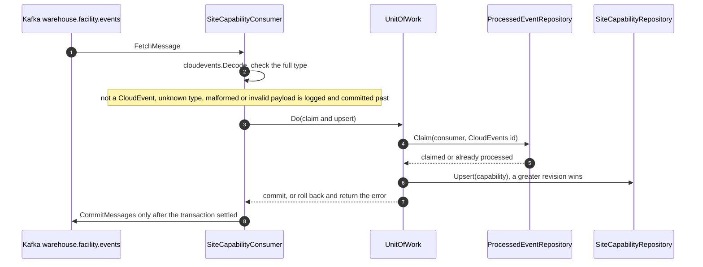
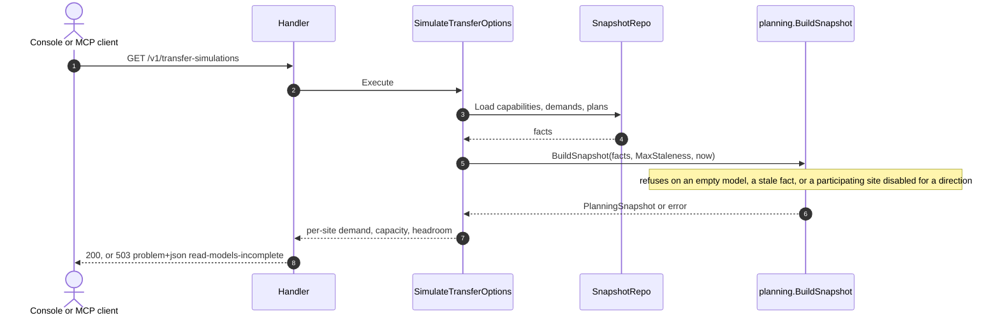
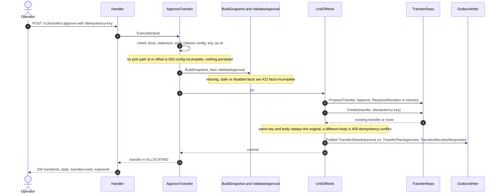
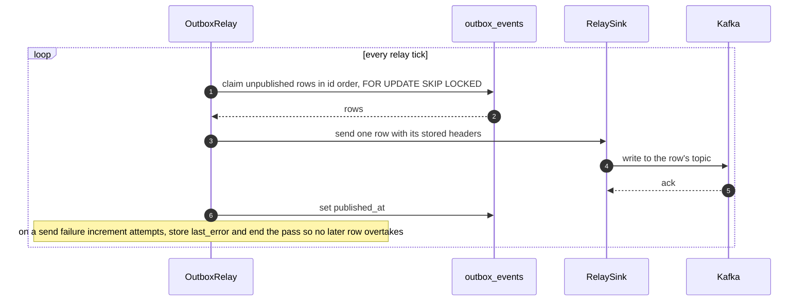
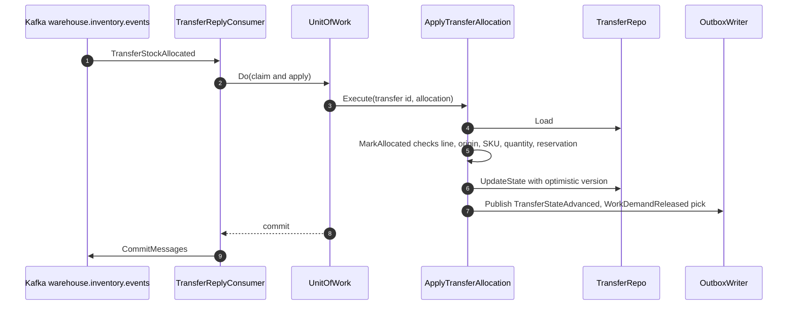
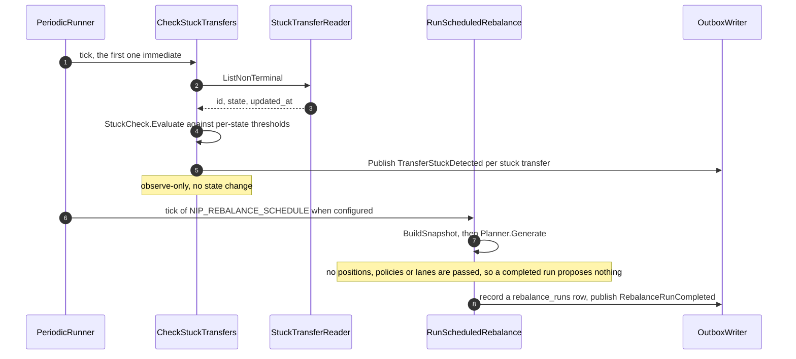
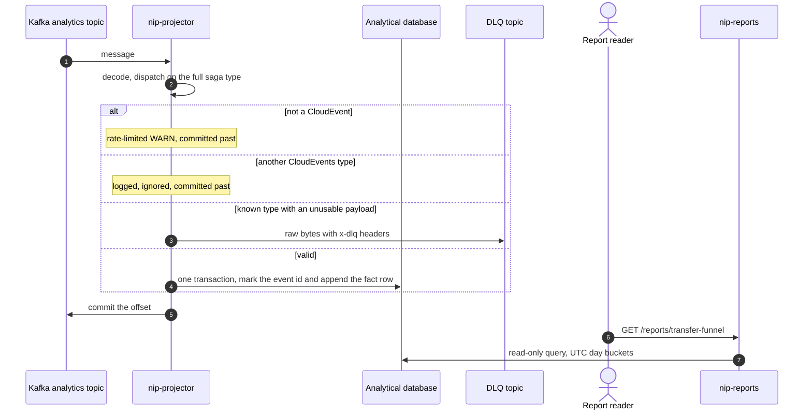

# Sequence diagrams

The main runtime interactions, from the use-case and adapter code. Replies
are shown as dashed returns or notes.

## 1. Project a sibling fact into a read model

All three read-model consumers share this shape; the example is
`SiteCapabilityChanged`.



Source: `internal/adapters/inbound/kafka/consumers.go`, `kafka.go` (`consumeLoop`)
Omits: the retry loop (200ms doubling to 5s, no attempt limit) and the
`traceparent` extraction before handling.

## 2. Advisory simulation (REST and MCP)



Source: `internal/adapters/inbound/http/handler.go`, `internal/application/usecases/simulate_transfer_options.go`, `internal/domain/planning/snapshot.go`
Without `DATABASE_URL` the handler answers 503 `read-models-unavailable`
before the use case. The MCP tool `simulate_transfer_options` calls the same
use case.

## 3. Approve a transfer



Source: `internal/application/usecases/approve_transfer.go`, `internal/domain/transfer/saga.go`, `approval.go`, `internal/adapters/outbound/postgres/transfer_repo.go`, `outbox.go`
The aggregate insert and every outbox row commit together or not at all.

## 4. Outbox relay to Kafka



Source: `internal/adapters/outbound/postgres/outbox.go`, `internal/adapters/outbound/kafka/publisher.go`, `cmd/network-inventory-planning/main.go`
The relay runs when `OUTBOX_RELAY_ENABLED` is true and `KAFKA_BROKERS` is set;
production sets no attempt cap, so a failing row is retried every tick.

## 5. Apply the allocation reply and release the pick



Source: `internal/application/usecases/transfer_facts.go`, `internal/adapters/inbound/kafka/transfer_reply_consumer.go`
`TransferStockAllocationRejected` follows the same shape, calls
`MarkUnfulfillable` and releases nothing.

## 6. Pick, dispatch, arrival and stow facts

```mermaid
sequenceDiagram
  autonumber
  participant K as Kafka
  participant C as Fact and reply consumers
  participant A as Apply use cases
  participant T as TransferRepo
  participant O as OutboxWriter
  K->>C: TransferPicked on warehouse.fulfillment.events
  C->>A: ApplyTransferPick
  A->>T: Load, MarkPicked, UpdateState
  A->>O: Publish TransferStateAdvanced, WorkDemandReleased dispatch with the picked quantity
  K->>C: TransferDispatched
  C->>A: ApplyTransferDispatched
  A->>T: MarkDispatched, UpdateState
  K->>C: TransferReceiptStaged on warehouse.inventory.events
  C->>A: ApplyTransferReceiptStaged
  A->>T: MarkArrived, UpdateState
  K->>C: TransferStockStowed
  C->>A: ApplyTransferStow
  A->>T: MarkStowed with the stow allocations, UpdateState
  Note over A: each fact is one transaction with its claim; unknown transfer, illegal transition or refused fact is logged and committed past
```

Source: `internal/application/usecases/transfer_facts.go`, `internal/adapters/inbound/kafka/transfer_fact_consumer.go`, `transfer_reply_consumer.go`
Omits: the reserved `TransferArrived`, which also calls `MarkArrived`.

## 7. Stuck check and scheduled rebalance



Source: `internal/application/usecases/periodic.go`, `saga_health.go`, `scheduled_rebalance.go`
A failed tick is logged and retried at the next interval. A snapshot refusal
is recorded as a `FAILED` run and publishes nothing.

## 8. Analytics projection and reports



Source: `cmd/nip-projector/main.go`, `internal/adapters/inbound/kafka/analytics_consumer.go`, `internal/adapters/outbound/analyticsstore/*.go`, `cmd/nip-reports/main.go`, `internal/analytics/report/*.go`
A transient failure retries the same message and is never dead-lettered. The
DLQ topic is `warehouse.network-inventory-planning.analytics.dlq`.
