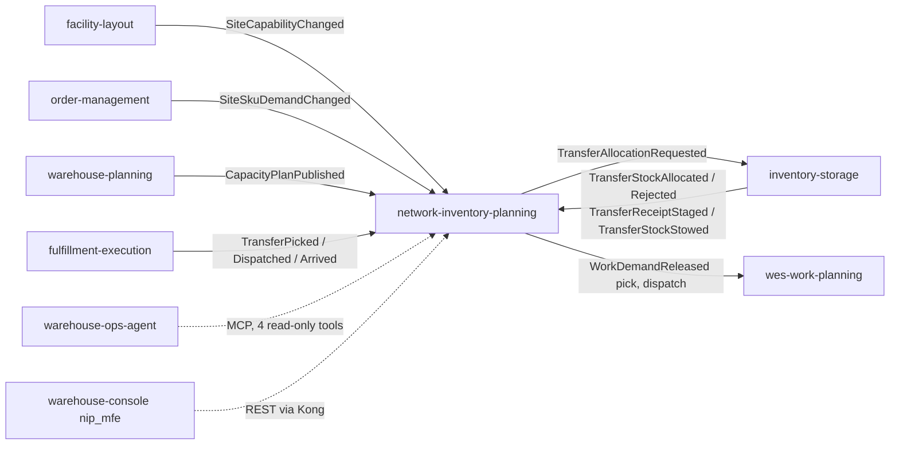

# Integration

NIP integrates with its neighbours **only through Kafka** (CloudEvents 1.0,
structured mode, `internal/adapters/kafka/cloudevents`). It makes no
synchronous REST or MCP call to any sibling context: the planning use cases
receive their inputs from local read models or from the request body. It is
itself called over REST (operators, the console remote) and MCP
(warehouse-ops-agent).

## Context map

Source: `internal/adapters/inbound/kafka/*.go`, `internal/adapters/outbound/kafka/*.go`, `internal/adapters/inbound/mcp/tools.go`

## Upstreams (NIP consumes)

| Context | Topic | CloudEvents `type` | Payload fields NIP reads | Effect | On failure |
| --- | --- | --- | --- | --- | --- |
| facility-layout | `warehouse.facility.events` | `com.warehouse.wms.facility-layout.site.SiteCapabilityChanged` | `site_code`, `transfer_origin_enabled`, `transfer_destination_enabled`, `capability_revision` (+ CE `time` as `as_of`) | Upsert `site_capability`; a strictly greater `capability_revision` wins | Malformed or invalid payload: WARN, committed past. Database error: the same message is retried, the partition waits. |
| order-management | `warehouse.order-management.events` | `com.warehouse.wes.order-management.siteskudemand.SiteSkuDemandChanged` | `source_order_id`, `line_no`, `site_id`, `sku`, `demanded_units`, `due_at`, `state` (`ACTIVE`/`REMOVED`), `assignment_version` | Upsert `site_sku_demand` keyed by `(source_order_id, line_no)`, last write wins with no ordering guard; `REMOVED` tombstones the line | Same as above. |
| warehouse-planning | `warehouse.warehouse-planning.events` | `com.warehouse.wes.warehouse-planning.capacityplan.CapacityPlanPublished` | `plan_id`, `site_id`, `location`, `path_id`, `window_start`, `window_end`, `assigned_demand`, `capacity_over_window`, `shortage`, `published_at` | Upsert `published_capacity_plan`; a newer `published_at` wins | A legacy event without `site_id` is excluded, never inferred. Others as above. |
| inventory-storage | `warehouse.inventory.events` | `com.warehouse.wms.inventory-storage.reservation.TransferStockAllocated` | `transfer_id`, `transfer_line_id`, `origin_site_id`, `reservation_id`, `sku`, `quantity`, `allocations[]{stock_unit_id, bin_id, quantity}`, `expires_at` | `ALLOCATING → ALLOCATED` and the pick `WorkDemandReleased`, one transaction | Unknown transfer or illegal state: WARN, skipped. A reply that does not match the transfer (line, origin, SKU, totals, missing reservation or expiry) is **not** classified as deterministic: the consumer retries it forever and the partition waits (see Troubleshooting). |
| inventory-storage | `warehouse.inventory.events` | `com.warehouse.wms.inventory-storage.reservation.TransferStockAllocationRejected` | `transfer_id`, `transfer_line_id`, `reason` (`ORIGIN_SITE_UNKNOWN`, `INSUFFICIENT_USABLE`, `IDEMPOTENCY_CONFLICT`) | `ALLOCATING → UNFULFILLABLE` | An unknown reason is a contract break: WARN, skipped. A rejection for a different `transfer_line_id` is retried forever (same classification gap). |
| inventory-storage | `warehouse.inventory.events` | `com.warehouse.wms.inventory-storage.stock.TransferReceiptStaged` | `transfer_id`, `transfer_line_id`, `destination_site_id`, `sku`, quantities | `IN_TRANSIT → ARRIVED` (scan-driven receiving) | Out-of-order or unknown: WARN, skipped. |
| inventory-storage | `warehouse.inventory.events` | `com.warehouse.wms.inventory-storage.stock.TransferStockStowed` | `transfer_id`, `transfer_line_id`, `destination_site_id`, `sku`, `received_quantity`, `stowed_quantity`, `allocations[]` | `ARRIVED → RECEIVED` with the stow allocations | Mismatch: `ErrFactRefused`, WARN, skipped. |
| fulfillment-execution | `warehouse.fulfillment.events` | `com.warehouse.wes.fulfillment-execution.transfer.TransferPicked` | `transfer_ref`, `quantity` (+ `demand_id`, `work_unit_id`, `task_id`, `work_kind`, `site_id`, `sku`) | `ALLOCATED → PICKED` with the picked quantity (short picks recorded) and the dispatch `WorkDemandReleased` | Unknown `transfer_ref`: WARN, skipped. Dispatch leg not configured: the transition commits, the demand is withheld, WARN. |
| fulfillment-execution | `warehouse.fulfillment.events` | `com.warehouse.wes.fulfillment-execution.transfer.TransferDispatched` | `transfer_ref` | `PICKED → IN_TRANSIT` | As above. |
| fulfillment-execution | `warehouse.fulfillment.events` | `com.warehouse.wes.fulfillment-execution.transfer.TransferArrived` | `transfer_ref` | `IN_TRANSIT → ARRIVED` (reserved kind; `TransferReceiptStaged` drives the same transition) | A transfer already past `IN_TRANSIT`: skipped. |

Every consumer dispatches on the full `type` string and ignores other types on
the topic; anything that is not a valid CloudEvents 1.0 message is skipped.
The group ids are configuration (see [Configuration](../operations/configuration.md));
in the kind deployment warehouse-infra sets
`network-inventory-planning-site-capability`, `-site-sku-demand`,
`-capacity-plan`, `-transfer-reply` and `-transfer-fact`.

## Downstreams (NIP publishes)

All through the transactional outbox and the relay (see the
[Runbook](../operations/runbook.md#outbox-relay)).

| Consumer | Topic | CloudEvents `type` | Key / subject | Payload | Contract owner |
| --- | --- | --- | --- | --- | --- |
| inventory-storage (its transfer allocation consumer) | `warehouse.network-inventory-planning.events` | `com.warehouse.wes.network-inventory-planning.transfer.TransferAllocationRequested` | `transfer_line_id` (`<transfer_id>:1`) | `transfer_id`, `transfer_line_id`, `origin_site_id`, `sku`, `quantity` | inventory-storage's consumed contract |
| wes-work-planning (its inbound work-demand consumer) | `warehouse.network-inventory-planning.events` | `com.warehouse.wes.network-inventory-planning.workdemand.WorkDemandReleased` | `demand_id` (`<transfer_id>:pick` or `<transfer_id>:dispatch`) | `demand_id`, `work_kind` (`TRANSFER_PICK`, `TRANSFER_DISPATCH`), `transfer_ref`, `path_id`, `site_id`, `cpt`, `sku`, `quantity` | wes-work-planning's consumed contract |
| no consumer found in the fleet | `warehouse.network-inventory-planning.events` | `com.warehouse.wes.network-inventory-planning.transfer.TransferPlanApproved` | transfer id | `transfer_id`, `origin_site_id`, `destination_site_id`, `sku`, `quantity`, `policy_version`, `operator_reason`, `proposal_as_of` | NIP |
| `nip-projector` (this repo) | `warehouse.network-inventory-planning.analytics` | `...network-inventory-planning.saga.TransferStateAdvanced`, `...saga.TransferStuckDetected`, `...saga.RebalanceRunCompleted` | transfer id / run id | see [Domain events](../ddd/domain-events.md) | NIP |

`source` is `/warehouse/network-inventory-planning`; `dataschema` is
`urn:warehouse:network-inventory-planning:<events|analytics>:<EventName>:v1`.
The work kind `TRANSFER_ARRIVAL` exists in the domain vocabulary but no
arrival demand is ever released: the arrival leg is driven by
inventory-storage's destination facts.

## Synchronous callers

| Caller | Protocol | Surface | Failure behaviour |
| --- | --- | --- | --- |
| Operators and the console remote `nip_mfe` (ADR 0010) | REST through Kong `:8000` under `/api/network-inventory-planning` | the routes in the [API reference](../api-reference/overview.md) | RFC 7807 problems; fail-closed 503/422 instead of fabricated answers |
| warehouse-ops-agent | MCP Streamable HTTP to the `mcp` Service (`:8090`) | `get_transfer`, `list_transfers`, `find_stuck_transfers`, `simulate_transfer_options` (see [MCP tools](../mcp/tools.md)) | `isError` tool results with a slug prefix |
| Dashboards / analysts | REST to `nip-reports` (ClusterIP, not routed by Kong) | `/reports/*` | 400 / 500 problems |

## Absent edges (on purpose)

- No call to inventory-storage for stock positions: proposals take positions
  in the request body, and the scheduled rebalance has no positions source yet.
- No consumer of process-path-management: the pick and dispatch path ids are
  plain configuration (`TRANSFER_PICK_PATH_ID`, `TRANSFER_DISPATCH_PATH_ID`).
- No outbound HTTP client of any kind, hence no circuit breaker or timeout
  configuration.
