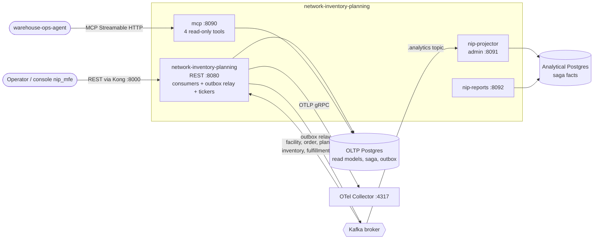
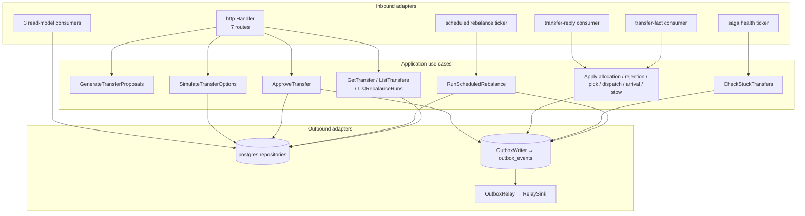

# Architecture

network-inventory-planning (NIP) is one Go module (`github.com/claudioed/network-inventory-planning`)
built into **four binaries** that share one container image, plus an optional
console remote (`web/`, the `nip_mfe` Module Federation remote of ADR 0010).
Everything below is read from `cmd/*/main.go`, the Dockerfile and
`charts/network-inventory-planning`.

## Hexagonal layout

| Layer | Package | What lives there |
| --- | --- | --- |
| Domain | `internal/domain/transfer` | The `InterWarehouseTransfer` saga aggregate (11 states), the deterministic `Planner`, `ValidateApproval`, the stuck-transfer check and the domain events (`TransferPlanApproved`, `TransferAllocationRequested`, `WorkDemandReleased`, the three saga-health occurrences). |
| Domain | `internal/domain/planning` | The three local facts (`SiteCapability`, `SiteSkuDemand`, `PublishedCapacityPlan`) and the fail-closed `BuildSnapshot`. |
| Domain-like read model | `internal/analytics/report` | Pure report rules for the analytics read side: half-open ranges, percentiles, rejection rates, freshness. |
| Application | `internal/application/usecases`, `internal/application/ports` | One use case per trigger (see [Use cases](../ddd/use-cases.md)); ports for repositories, the query side, the unit of work and the event publisher. |
| Inbound adapters | `internal/adapters/inbound/http` | REST handler (`Handler.Routes`) and the reports handler (`ReportsServer.Routes`). |
| Inbound adapters | `internal/adapters/inbound/kafka` | Seven consumers: three read-model consumers, the inventory reply consumer, the fulfillment fact consumer and the analytics projector consumer. |
| Inbound adapters | `internal/adapters/inbound/mcp` | The read-only MCP server (four tools). |
| Outbound adapters | `internal/adapters/outbound/postgres` | pgx repositories, the unit of work, the transactional outbox writer and relay, golang-migrate runner and the OLTP migrations. |
| Outbound adapters | `internal/adapters/outbound/kafka` | The CloudEvents encoders (integration and analytics) and the relay sink. |
| Outbound adapters | `internal/adapters/outbound/analyticsstore` | The analytical database projection (writer) and report reader. |
| Outbound adapters | `internal/adapters/outbound/telemetry` | OTLP/gRPC trace + metric export (ADR 0012). |
| Shared | `internal/adapters/kafka/cloudevents` | The single CloudEvents 1.0 envelope (structured mode). |
| Shared | `internal/bootretry` | Startup retry used by the two analytics binaries. |

`internal/architecture` holds the fitness tests that pin these dependency rules
(see [Testing](../development/testing.md)).

## Binaries

| Binary (`cmd/`) | Role | Listens on | Deployment (chart component) | Talks to |
| --- | --- | --- | --- | --- |
| `network-inventory-planning` | REST API, the five OLTP Kafka consumers, the outbox relay, the saga-health ticker and the scheduled-rebalance ticker | `HTTP_ADDR`, default `:8080` | `api` (Service port 80 → 8080), image entrypoint | OLTP Postgres, Kafka, OTel Collector |
| `mcp` | Read-only MCP server, Streamable HTTP only, served at `/` and `/mcp` plus `GET /healthz` | `MCP_ADDR`, default `:8090` | `mcp` (Service port 8090), disabled by default | OLTP Postgres (read; it also applies migrations) |
| `nip-projector` | The only writer of the analytical database: consumes `warehouse.network-inventory-planning.analytics` and projects it | admin `ADMIN_ADDR`, default `:8091` (`/healthz`, `/readyz`) | `analytics-projector`, disabled by default | Kafka, analytical Postgres |
| `nip-reports` | Read-only reports over the analytical database (`GET /reports/...`) | `HTTP_ADDR`, default `:8092` | `analytics-reports` (Service port 80 → 8092), disabled by default | analytical Postgres (read-only pool) |

The image (`Dockerfile`) builds all four into `/app`, copies the OLTP
migrations to `/app/migrations` (and sets `MIGRATIONS_PATH=migrations`) and the
analytical migrations to `/app/analytics/migrations`; it exposes
`8080 8090 8091 8092` and its entrypoint is `./network-inventory-planning`. The
chart's other Deployments override the command with `/app/mcp`,
`/app/nip-projector` and `/app/nip-reports`.

The console remote is a separate image (`warehouse/network-inventory-planning-frontend`,
built from `web/Dockerfile`), deployed by the chart's optional `frontend`
component (ClusterIP, port 80 → 8080) and routed by the warehouse-infra Nginx
gateway under `/mfes/network-inventory-planning/`.

## Container diagram

Source: `cmd/network-inventory-planning/main.go`, `cmd/mcp/main.go`, `cmd/nip-projector/main.go`, `cmd/nip-reports/main.go`, `charts/network-inventory-planning/values.yaml`

## Component view of the API binary

Source: `cmd/network-inventory-planning/main.go` (`wire`, `wireSagas`, `wireOutbox`, `startConsumers`, `wireHealthTicker`, `wireRebalanceTicker`)

## Startup modes of the API binary

`wire` in `cmd/network-inventory-planning/main.go` decides what exists:

| Configuration | What runs |
| --- | --- |
| `DATABASE_URL` unset | Only `GET /healthz` and `POST /v1/transfer-proposals:generate` work. Every other route answers a 503 problem (`read-models-unavailable`, `saga-unavailable`, `rebalance-runs-unavailable`, `read-side-unavailable`). No migrations, no consumers. |
| `DATABASE_URL` set | Migrations run (refuse to boot on failure), the pool is pinged, simulation and the read side are wired. |
| + `KAFKA_BROKERS` | The outbox writer exists, so `POST /v1/transfers:approve` is wired; each consumer whose `*_CONSUMER_GROUP` is set starts; the saga-health ticker starts (default every 5 m). |
| + `OUTBOX_RELAY_ENABLED` non-empty | The relay drains `outbox_events` onto Kafka. Without it the rows wait. |
| + `TRANSFER_PICK_PATH_ID` and a valid pick CPT offset | Approval is accepted; otherwise it answers 503 `config-incomplete`. |
| + `NIP_REBALANCE_SCHEDULE` | The observe-only rebalance ticker starts. |

## Data stores

| Store | Owner binary | Tables | Migrations |
| --- | --- | --- | --- |
| OLTP Postgres (`DATABASE_URL`) | `network-inventory-planning` (writes), `mcp` (reads) | `processed_events`, `site_capability`, `site_sku_demand`, `published_capacity_plan`, `inter_warehouse_transfer`, `transfer_audit`, `outbox_events`, `rebalance_runs` | `internal/adapters/outbound/postgres/migrations/0001`–`0004`, applied at startup by both `network-inventory-planning` and `mcp` (golang-migrate's advisory lock serialises concurrent starts) |
| Analytical Postgres (`ANALYTICS_DATABASE_URL`) | `nip-projector` (only writer), `nip-reports` (read-only pool, `default_transaction_read_only=on`) | `analytics_processed_events`, `transfer_state_advances`, `transfer_stuck_detections`, `rebalance_run_facts` | `analytics/migrations/0001_saga_facts`, applied at startup by `nip-projector` only |

The entity-relationship view is on [Entity relationship](../ddd/entity-relationship.md).

Connection pools: OLTP `MaxConns = 10` with `statement_timeout = 5s`
(`internal/adapters/outbound/postgres/pool.go`); analytical writer and reader
`MaxConns = 5` each (`internal/adapters/outbound/analyticsstore/pool.go`).

## Integration style

- All cross-context traffic is Kafka with CloudEvents 1.0 in structured mode
  (`content-type: application/cloudevents+json; charset=UTF-8`). NIP makes no
  synchronous call to any sibling context.
- Everything NIP publishes goes through the transactional outbox
  (`outbox_events`), drained one row at a time in id order.
- REST and MCP are unauthenticated; the fitness test
  `TestNoAuthMiddlewareReintroduced` keeps it that way.

See [Integration](../ecosystem/integration.md) for every topic and type.
